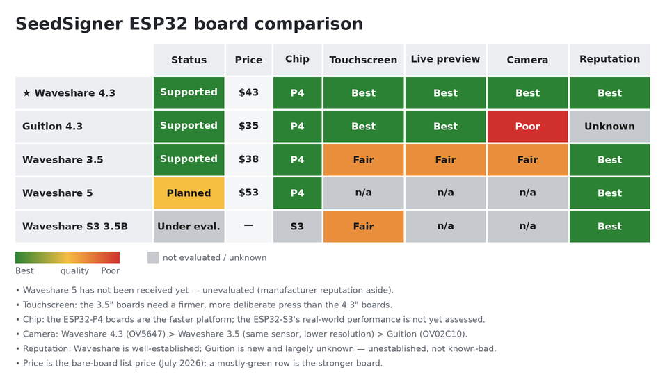

# Board hardware details

Full detail on the boards this firmware targets. For the at-a-glance list (price, status), see the
**Supported hardware** table in the [README](../README.md). Prices are list prices as of July 2026.

## At a glance

A mostly-green row is the stronger board. Regenerate after editing the ratings with
`python3 tools/gen_board_comparison.py`.

## Boards

### Waveshare ESP32-P4-WIFI6-Touch-LCD-4.3 — ✅ Supported · ⭐ Recommended

**The recommended board** — the most thoroughly tested and the main focus of development. ESP32-P4
with a 4.3″ 480×800 **MIPI-DSI** panel (ST7701) and an OV5647 camera. The OV5647 is **included** at
the listed ~$43 (it is an optional add-on otherwise).
[Product page](https://www.waveshare.com/esp32-p4-wifi6-touch-lcd-4.3.htm)

### Guition JC4880P443 — ✅ Supported

A low-cost, non-Waveshare twin of the P4-4.3: ESP32-P4 with a 4.3″ 480×800 **MIPI-DSI** panel
(ST7701S), GT911 touch, an **OV02C10 camera onboard**, 32 MB PSRAM and 16 MB flash. The ~$35 listing
is the bare board; an [enclosed version](https://www.aliexpress.us/item/3256809487310720.html) is
~$41.
[Product page](https://www.aliexpress.us/item/3256809431944589.html)

### Waveshare ESP32-P4-WIFI6-Touch-LCD-3.5 — ✅ Supported

ESP32-P4 with a 3.5″ 320×480 **SPI** panel (ST7796) and an onboard camera. The listed ~$38 is the
no-battery configuration.
[Product page](https://www.waveshare.com/esp32-p4-wifi6-touch-lcd-3.5.htm)

### Waveshare ESP32-P4-WIFI6-Touch-LCD-5 — 🚧 Planned

ESP32-P4 with a 5″ display and an OV5647 camera (**included** at the listed ~$53). Not yet built for.
[Product page](https://www.waveshare.com/esp32-p4-wifi6-touch-lcd-5.htm)

### Waveshare ESP32-S3-Touch-LCD-3.5B — 🔬 Under evaluation

ESP32-S3 with a 3.5″ 320×480 display. A possible lower-performance future target — see below.
[Product page](https://www.waveshare.com/esp32-s3-touch-lcd-3.5b.htm)

## Display performance — MIPI-DSI vs SPI

The 3.5″ board's display is noticeably slower than the 4.3″ boards (the Guition is a MIPI-DSI 4.3″
board like the Waveshare).

- *In practice:* the **live camera preview (QR scanning) is noticeably choppier** on the 3.5″. Static
  screens and menus are largely unaffected.
- *Why:* the 4.3″ boards drive their panels over **MIPI-DSI**, while the 3.5″ uses a slower **SPI**
  bus that can't push full-frame camera updates as fast.

## ESP32-P4 vs. ESP32-S3

The P4 is the faster board where it counts.

- *In practice:* the live camera preview is smoother, QR and animated-QR codes scan and decode
  noticeably quicker, and signing operations (cryptographic math, PSBT parsing) feel snappier than on
  the S3.
- *Why:* the P4 has a faster CPU (**400 MHz dual-core RISC-V** vs. the S3's **240 MHz dual-core
  Xtensa**) plus camera and display hardware the S3 lacks — a hardware **image signal processor** and
  **MIPI** interfaces, where the S3 falls back to slower parallel/QSPI buses.

That gap is why S3 support is uncertain — and if it does land, the S3 stays the lower-performance
option, not a peer of the P4.
